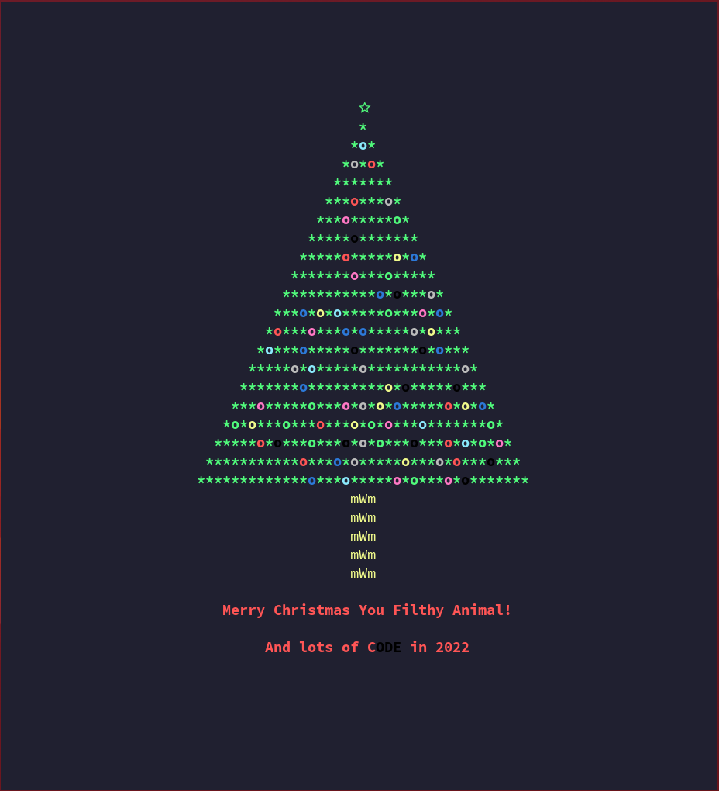

# christmas.sh

## About

This is slightly modified from [this script by sergiolepore](https://github.com/sergiolepore/ChristBASHTree). This one just has some different options available to change the size, Christmas message, and the option to add a Nerd Font star on top of the tree.

I would tell you that this is not [this Christmas Tree](https://en.wikipedia.org/wiki/Christmas_Tree_EXEC) but would you really believe me?

This script utilizes a Nerd Font star so you need to have one of the Nerd Fonts installed. Check them out [here](https://www.nerdfonts.com)

I'll try adding some options later to beef it out and customize it a little later.

## Example



## Usage

```
 usage: christmas.sh [options]

 A simple ASCII Christmas tree with a few customizable options.

 This is NOT the malicious one, check the script for yourself.

 options:
    -h, --help          show this message

    -s N, --size N      set the size of the christmas tree to integer N
                        max value is 50, min value is 5
    -S, --star          use a Nerd Font star on top of the tree (default)
                        if a Nerd Font is not installed this will appear
                        to be a broken character
    -N, --no-star       do not use a Nerd Font star on top of the tree
    -m, --xmas-message  message to display directly under the Christmas Tree
                        multi-worded message should be in quotes or using
                        an escape space character

 source: https://github.com/alex-laycalvert/fun-scripts

 modified by a similar script by sergiolepore at https://github.com/sergiolepore/ChristBASHTree
```
