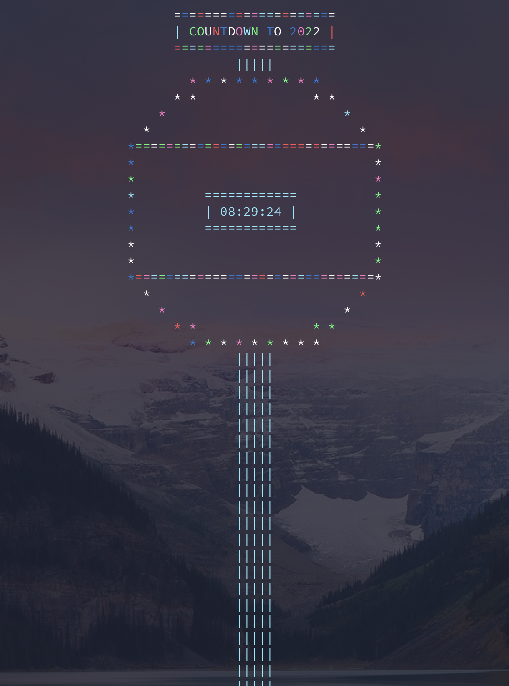

# newyears

## About

This is a very basic countdown to the New Year that will (by default) only run on December 31st. If it is forced to run on the current date it will countdown to midnight.

I'm not that great at Rust, I didn't have too much time to optimize it so there's probably a lot of bugs.

## Example



## Installation

This can be installed via **cargo**:

```
# In the terminal of your choice
cd ~/Downloads    # or wherever you downloaded it
chmod +x ./newyears

# Running
./newyears # [options]
```

Alternatively you can download the raw executable within this directory and run it.

You may need to fix the permissions if downloading the executable:

```
chmod +x /path/to/newyears
```

## Usage

```
newyears - A simple New Year's countdown written in Rust

usage: newyears [options]

description:
      This is a simple counter to midnight that will, by default, only run on December 31st of the current year. You can force it to run on the current day but it will only count to midnight because I wrote this in one day before New Year's and didn't have time to learn more Rust

options:
    -h, --help                        display this menu
    -r <N>, --radius <N>              set radius of the New Year's ball to the integer N (default: 7, min: 3, max: 10)
    -c <C>, --color <C>               set the color of the New Year's ball and countdown message to the color code C
    -C <char>, --circle-char <char>   set the character that the bar is comprised of (default: '|')
                                      note: must be a single character
                                      see available color codes below
    -t <N>, --circle-thickness <N>    set the thickness of the New' Years ball to the integer N (default: 1, min: 1, max: 3)
    -b <C>, --bar-color <C>           set the color of the bar to the color code C
    -B <char>, --bar-char <char>      set the character that the bar is comprised of (default: '|')
                                      note: must be a single character
    -T <N>, --bar-thickness <N>       set the thickness of the bar (default: 3, min: 1, max: 5)
    -m <string>, --message <string>   set the message that will be displayed in big ASCII text at the end of the countdown
    -M <C>, --message-color <C>       set the color of the message being displayed at the end to the color code C
    -i <C>, --time-color <C>          set the color of the countdown on the New Year's ball to the color code C
    -n, --now                         make the coutndown start immediately
                                      this effectively just makes a countdown to midnight of the current day and does not do a countdown to New Year's of the current year

color codes:
    0 - red
    1 - yellow
    2 - green
    3 - blue
    4 - cyan
    5 - magenta
    6 - white
    7 - random

source: https://github.com/alex-laycalvert/fun-scripts

by: alex-laycalvert
```
